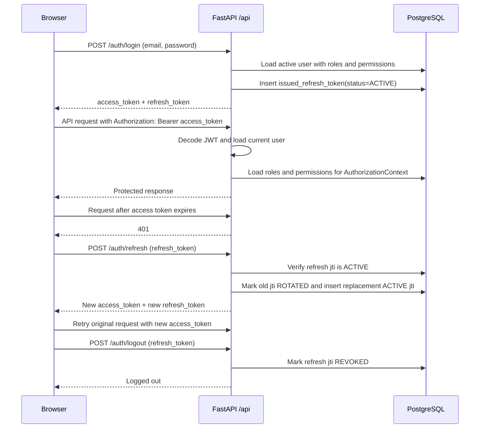
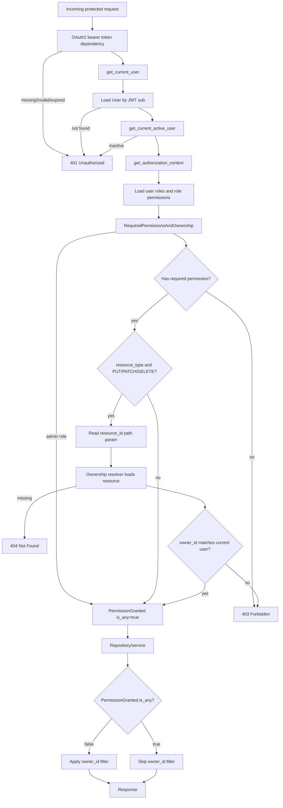

# Auth Architecture

The backend uses FastAPI dependencies, JWT access tokens, rotating refresh tokens, role-based access control, and row ownership through `owner_id`.

## Token Flow

Login accepts `application/x-www-form-urlencoded` credentials through `OAuth2PasswordRequestForm`; the username field is the user's email. Access tokens contain `sub`, `user_id`, `roles`, `permissions`, `type=access`, `jti`, `exp`, `iat`, and `iss`. Refresh tokens contain identity and token metadata, but not roles or permissions.

The frontend keeps the refresh token in `localStorage`, keeps the access token in Pinia state, attaches the access token in the Axios request interceptor, and performs single-flight refresh on `401`. Single-flight refresh is important because the backend rotates refresh tokens and rejects reuse.

## Refresh-On-401

`frontend/src/lib/axios.ts` owns automatic recovery:

1. Protected requests use `api`, which adds `Authorization: Bearer <access_token>`.
2. If a non-auth endpoint returns `401`, the client calls `/auth/refresh` once and shares that promise across concurrent requests.
3. The original request is retried with the new access token.
4. If refresh fails, an auth endpoint returns `401`, or the retried request returns `401`, the frontend clears the session and redirects to `/login`.

## Logout

Logout posts the refresh token to `/auth/logout`. The backend validates that the token is active and marks its `issued_refresh_token.status` as `REVOKED`. The frontend clears local auth/admin/app stores in a `finally` block, so local logout still happens if the server call fails.

## Request Lifecycle

## Ownership Model

Owned tables inherit `OwnerMixin` and have a non-null `owner_id` FK to `users.id`. Current owned resources include:

- `sources`
- `crawl_jobs`
- `monitored_keywords`
- `outbox_events`
- `articles`
- `keyword_hits`

Reads are scoped in repositories/services with `filter_owned_resources()`: callers with `:own` permissions see only rows where `owner_id == current_user.id`; callers with an `:any` permission or the `admin` role see all rows. Mutating routes that pass a `resource_type` also perform an ownership check against `{resource_id}` for `PUT`, `PATCH`, and `DELETE`.

Admins bypass both permission matching and ownership checks because `RequiredPermissionsAndOwnership` returns `PermissionGranted(is_any=True)` whenever the caller has the `admin` role. Admin-only management routes use `RequiredRoles("admin")`, so custom roles cannot access `/admin/*` unless they are named `admin`.
